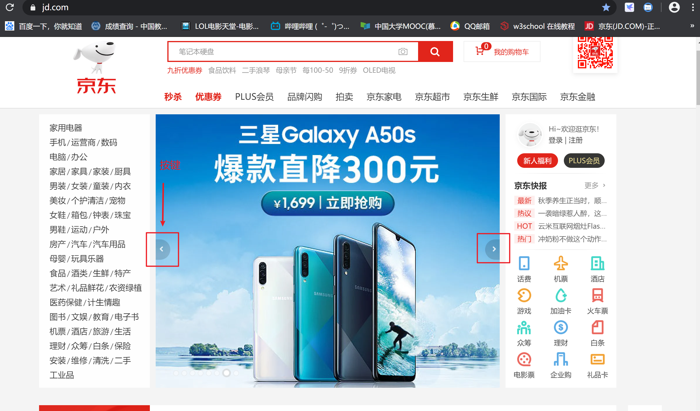

### 5.8需求  
### 主界面设计和实现
在主界面中央，添加一个轮播图  
用热门游戏的宣传图作为图片  
轮播图大小为：长600px，高400px  
> 这个尺寸仅供参考，具体尺寸取决于你找的游戏宣传图的实际大小

期望的效果：
1. 图片左右有2个控制滚动的按键
2. 鼠标单击按键，就滚动到上/下一张图片
3. 暂时可以只放3-4张图
> 其实如果你学会了怎么做轮播图的话，图片数量根本不重要  

具体的效果可以参考[京东首页](https://www.jd.com/)

