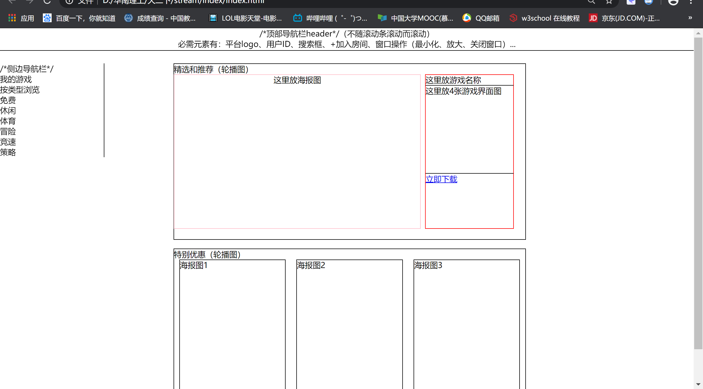

### 初步绘制主界面  

大厅的主界面整体上由三个部分组成：
1. 顶部导航栏 header
2. 侧边导航栏 nav_bar
3. 主体内容 content
> 这几次迭代的目标是完成**静态的页面布局**

#### 顶部导航栏 header
水平地展现在主界面顶部  
必要的元素有：（从左向右）  
平台LOGO、用户ID、搜索框、“加入房间”等
> 具体的元素后续可以继续添加，这里只是列举必要的元素  

#### 侧边导航栏 nav_bar
按竖直的方向展现在主界面左边  
必要的元素有：（从上到下）  
我的游戏、按类型浏览（免费、体育、休闲、冒险、策略）

#### 主体内容 content
暂时留白  

下面是我用html+CSS绘制的效果图
