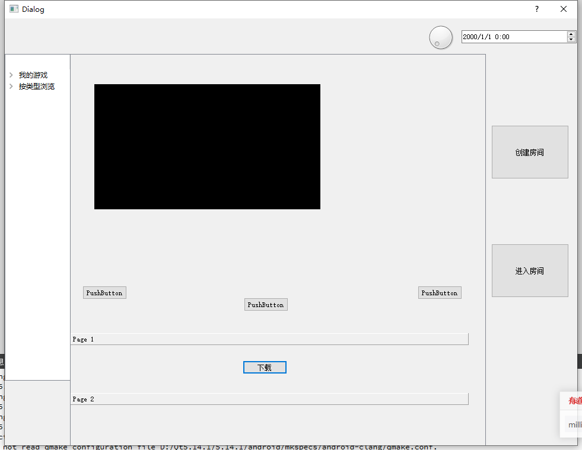

4.28需求更新

- 登陆时,如果账号密码不对会弹出窗口并提示不对
- 修复了有时候密码不对也能登陆的bug
- 登陆失败时会自动清空密码框 而不会清楚对话框
- 主窗口已经做好了,现在还不能自动滚动,因为如果定时3s滚动的话 调用sleep函数会使整个进程阻塞 开销太大 ,后面可能会开一个守护进程pageSwitchDaemon来阻塞切换 或者用一个定时器?
- 现在点那个下载可以测试滚动效果

